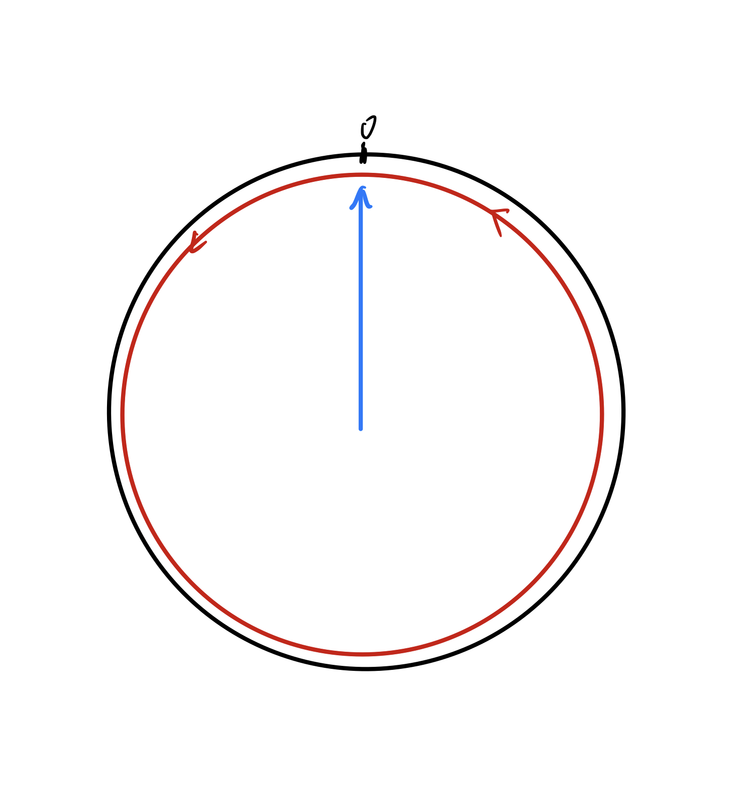

  

<div style="text-align:center;font-size:2em;font-weight:bold">中国科学技术大学计算机学院</div>

<div style="text-align:center;font-size:2em;font-weight:bold">《计算机系统概论实验报告》</div>


<div style="display: flex;flex-direction: column;align-items: center;font-size:2em">
<div>
<p>实验题目：LC3机器码指令实现乘法 </p>
<p>学生姓名：叶子昂</p>
<p>学生学号：PB20020586</p>
<p>完成时间：2021年11月26日</p>
</div>
</div>


<div style="page-break-after:always"></div>

#### 实验目的：

实现与c语言short型整数乘法结果相同的乘法LC3程序

#### 实验环境：

windows,  LC3Tool，wsl2

#### 实验过程：

##### L版本：

最初版本（10行）

* 为追求最短的指令条数，不必在乎程序效率。首先想到的就是根据被乘数的大小，对乘数进行累加。

* 实现过程中需考虑被乘数的正负，要设置两个循环，还要求乘数的相反数（被乘数为正数时对乘数累加，被乘数为负数时对乘数的相反数进行累加）

* 实现代码如下：（；中间为主要部分；）

  ```verilog
  0011 000000000000
  0101 111 010 1 00000
  1001 010 000 111111
  ;;;;;;;;;;;;;;;;;;;;;;;;;;;;;;;;;;
  0001 010 010 1 00001;对R0取反放入R2
  0001 011 001 1 00000;判断R1是否为负
  0000 010 000000111;被乘数为0跳转结束
  0000 100 000000011
  0001 111 011 000 000;执行被乘数为正的累加
  0001 001 001 1 11111;被乘数--
  0000 111 111111011;br back
  0001 111 011 000 010;执行被乘数为负的累加
  0001 001 001 1 00001;被乘数++
  0000 111 111111000;br back
  ;;;;;;;;;;;;;;;;;;;;;;;;;;;;;;;;;;
  1111 0000 00100101
  ```

  

最终版本（4行）

* 最初版本的方法属于思维固化于现实中人的手算，没有考虑到2进制补码存储的特性，以及溢出会回退（从1111...回0000...）的含最大位数限制计算机计算的特点。

* 考虑到这些特点后，可以将被乘数为正，为负，为0三种情况合为一种进行计算。

* 被乘数为正时，用被乘数--很好理解。

* 被乘数为0时，相当于累加了存储最大数+1次被乘数，由于溢出部分不会被存储这种情况相当于绕时钟转了正数圈还是为0.

  

* 被乘数为负数时，累加结果会溢出到符号位结果相当于时钟转一圈回到原位置再加回去。

  

* 这样的话对于被乘数为负数或0时**算法效率很差**，但是**减少了不少分类指令。**  


* 实现代码如下：

  ```verilog
  0011 000000000000
  ;;;;;;;;;;;;;;;;;;;;;;;;;;;;;;;
  0001 111 111 0 00 000;累加一次R0 
  0001 001 001 1 11111;被乘数--
  0000 010 000000001;判终止
  0000 111 111111100;br back
  ;;;;;;;;;;;;;;;;;;;;;;;;;;;;;;;
  1111 0000 00100101
  ```

**执行行数的统计**
* 排开代码中设定程序初始执行位置，Halt，以及初始化寄存器。代码行数由优化前10行减至4行。

##### P版本：

最初版本：（>20行）*未实现完全*

* 考虑程序执行的效率，首先想到移位，对被乘数检测最后一位，确定是否该加，然后右移。对乘数每次循环左移一次

* 同样考虑被乘数为正数，负数，0。有较为繁琐的讨论。

* 实现过程由于LC3没有右移指令或简单的右移方法，实现起来较为复杂，又要用到额外的寄存器暂存右移时的数据。未实现完全。部分代码如下：

  ```verilog
  0011 000000000000
  0101 000 000 1 00000 ;R0<-0
  0101 100 100 1 00000 ;R4<-0
  0101 101 110 1 00000 ;R5<-0
  0101 111 111 1 00000 ;R7<-0         ;初始化
  0010 001 01111101    ;R1<-LD X3100
  0010 010 01111011    ;R2<-LD X3101  ;读入基本值需要改位置
  0000 010             ;R2=0? 
  0000 100             ;R2<0?
  0110 110 001 000000  ;R6<-R1        ;乘数为正时计算
  0101 101 010 1 00001 ;R5<-R2最后一位
  0000 010 000000001   ;R5=0?
  0001 100 001 0 00 110;R4<-R1+R6
  0001 110 110 0 00 110;R6<<左移一位
                       ;R2<<右移一位
  0000 010             ;finished
  0000 111             ;重复执行
                       ;              ;乘数为负时计算
  1111 0000 0010 0101
  
  ```

  

最终版本：

* 优化核心是右移太困难，左移却非常简单。与其将被乘数右移不如**将检测数左移**而不死板的检查最后一位即可。

* 关于被乘数为正数，负数，0的优化思想与L版本一致。

* 判断程序终止的R2初始为1111 1111 1111 1111，每左移一位为1的位数均左移一位，右侧补0，达到检测被乘数R1，未检测位是否还含1的目的。

* 判断是否该加的R3初始化为0000 0000 0000 0001，每左移一位  1随之左移一位达到逐次检测被乘数位数是否为1的目的。

* 实现代码如下：

  ```verilog
  0011 000000000000
  0010 000 000001111;提取数据
  0010 001 000001111
  0101 111 111 1 00000 ;R7初始化
  ;;;;;;;;;;;;;;;;;;;;;;;;;;;;;;;;;;;;;;;;;;;;;;;;;;;;;;;;;;;;;
  0001 010 111 1 11111 ;r2用于判断被乘数的是否含"1"//终止检测数
  0001 011 111 1 00001 ;r3用于判断是否被乘数当前位是否为"1"//检测数
  0101 001 001 0 00 010;r2判终止
  0000 010 000000111;为0跳转结束
  0101 100 001 0 00 011;是否该加
  0000 010 000000001;为0不加
  0001 111 111 0 00 000;加
  0001 000 000 0 00 000;右移被乘数准备下一次加
  0001 010 010 0 00 010;右移r2以判断左位是否还含"1"
  0001 011 011 0 00 011;右移r3以判断下一位是否该加
  0000 111 111110111;br back
  ;;;;;;;;;;;;;;;;;;;;;;;;;;;;;;;;;;;;;;;;;;;;;;;;;;;;;;;;;;;;;;
  0011 111 000000011;存储结果方便查看
  1111 0000 00100101;halt
  
  ```

**执行数的统计**：

* 在返回指令前添加一条R5++(0001 101 101 1 00001)，可以统计循环次数。由于循环总是从头开始（0001 010 111 1 11111）中间的条件判断只会跳过一句。故通过循环执行次数乘以代码总长可以估算指令执行数。代码如下：

  ```verilog
  0011 000000000000
  ; 0010 000 000001111;提取数据
  ; 0010 001 000001111
  0101 111 111 1 00000 ;R7初始化
  ;;;;;;;;;;;;;;;;;;;;;;;;;;;;;;;;;;;;;;;;;;;;;;;;;;;;;;;;;;;;;
  0001 010 111 1 11111 ;r2用于判断被乘数的是否含"1"//终止检测数
  0001 011 111 1 00001 ;r3用于判断是否被乘数当前位是否为"1"//检测数
  0101 001 001 0 00 010;判终止
  0000 010 000001000;为0跳转结束
  0101 100 001 0 00 011;是否该加
  0000 010 000000001;为0不加
  0001 111 111 0 00 000;加
  0001 000 000 0 00 000;右移被乘数准备下一次加
  0001 010 010 0 00 010;右移r2以判断左位是否还含"1"
  0001 011 011 0 00 011;右移r3以判断下一位是否该加
  ;;;;;;;;;;;;;;;;;;;;;
  0001 101 101 1 00001;计循环数
  ;;;;;;;;;;;;;;;;;;;;;
  0000 111 111110110;br back
  ;;;;;;;;;;;;;;;;;;;;;;;;;;;;;;;;;;;;;;;;;;;;;;;;;;;;;;;;;;;;;;
  ; 0011 111 000000011;存储结果方便查看
  1111 0000 00100101;halt
  ```

* 扩大化估计：（循环数+1） * 指令总长（11不含计循环数指令）

* 样例测试：测试助教给出的五个样例。循环数分别为1，12，3，9，16

* 平均循环数为：41/5=8.2

* 扩大化估计平局指令执行数为：9.2*11=101.2

* 从而P版本在所给出样例中平均值执行数不大于102。

#### 实验总结

* LC3本身没有乘法，通过LC3有限的指令分别实现最短和最高效的程序需要灵活运用各指令和二级制运算的特性。
* 二进制的运算为统一正负，采用了补码这一特殊的数据存储方式，利用好补码的特性能够有效减少对运算时数据正负的讨论。
* 对二进制进行移位，可以大大提高乘法的运行效率，LC3没有右移指令，但可以通过检测数左移来代替被检测数右移。
* 通过对算法的改进与优化，我能够更熟练的运用LC3的指令，并且加深了我对二进制运算的理解。对计算机如何进行运算有了更底层的理解。
